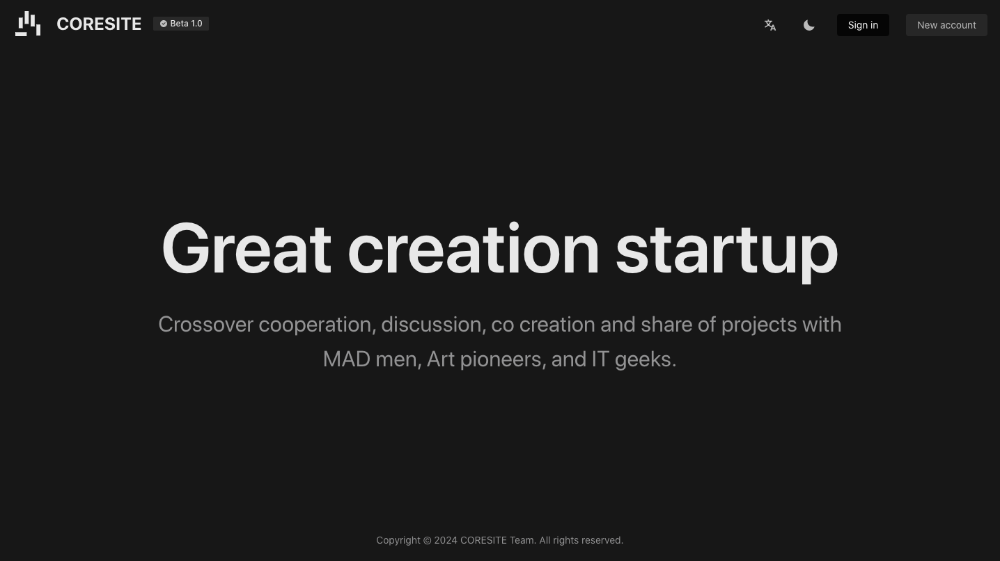

# CORESITE

version: `beta1.0`

[中文版](./README_zh-CN.md)

## Introduction

CORESITE is an open-source system for online communication, collaboration, and sharing for creative teams. At present, the infrastructure and simple functions have been completed, and will be gradually improved in the future.

## Environment

- php 7.4+
- mysql 5.7+
- redis 5.0+
- nodejs 18+

## Characteristics

- Development based on Vue3+Thinkph6+ArcoDesign framework
- Unified Certification Center (JWT)

## Experience

- website: http://www.coresite.cn

## Development team

@[uuz1623](https://github.com/uuz1632) @[油老师](https://github.com/yoniu) @[bbpalm](https://github.com/bbpalm)

## Open source protocol

[MIT](./LICENSE) © CORESITE Team

## Special Thanks

- [ThinkPHP](https://github.com/top-think)
- [ArcoDesign](https://github.com/arco-design)
- [vue](https://github.com/vuejs)
